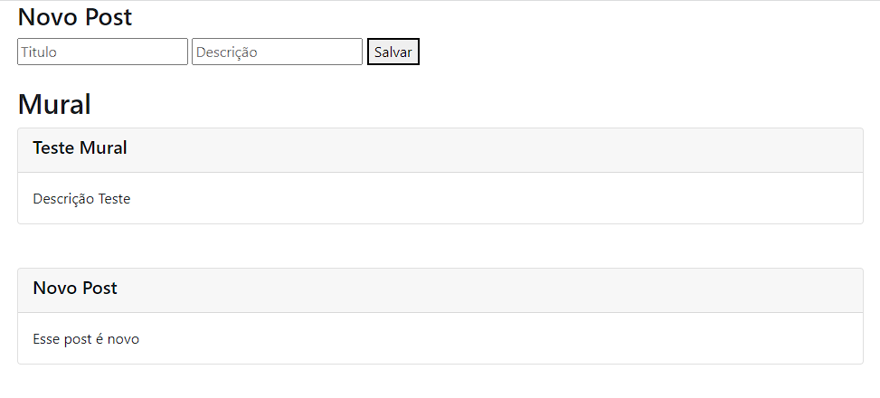

# Mural de Avisos

<p style="font-size: 16px;">Mural de avisos é um aplicativo desenvolvido com Node-js.
<br>
Este projeto foi desenvolvido para treinar meus conhecimentos com Node-js e JavaScript.</p>

<hr>

## Tecnologias Utilizadas

- JavaScript
- Node-js
- Bootstrap

<hr>

## Visual do Mural

<p>Introdução</p>


<hr>

## Para testar na sua máquina

<p>Pré-requisitos</p>
<p>Você precisa ter instalado na sua máquina as ferramentas: <a href="https://git-scm.com/">Git</a>, <a href="https://nodejs.org/en/">Node.js</a> e também <a href="https://code.visualstudio.com/">Vscode</a> com a extensão liveServer</p>

```bash
# Basta clonar o repositório em sua máquina
$ git clone https://github.com/CanezinBeto/mural-avisos.git

# Para instalar as dependências
$ npm install

# Inicializar o servidor
$ npm start
```

Desenvolvido por Alberto Canezin :rocket: [veja meu LinkeIn](https://www.linkedin.com/in/albertocanezin-dev/)
